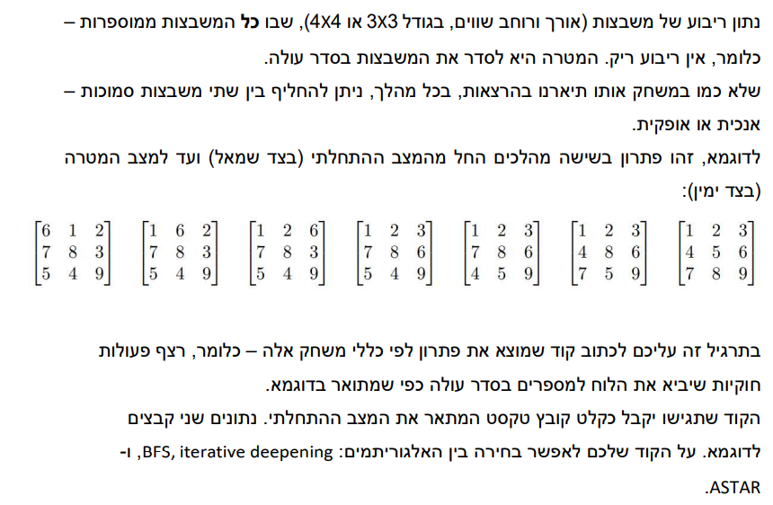
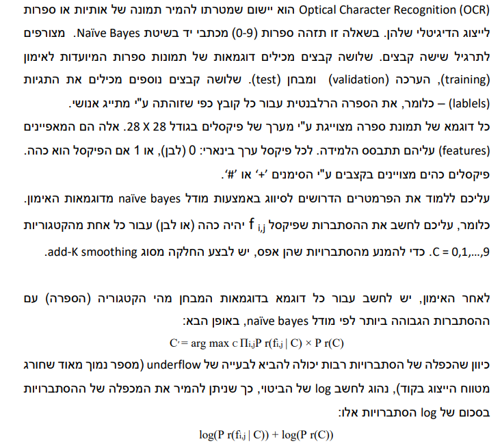
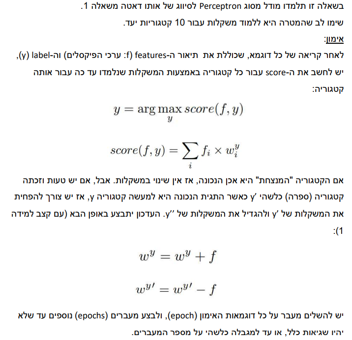

# AI

### <ins> 1) Search algorithm:</ins> 

* BFS
* A_Star
* ID_DFS

Implementation of State and Cell class and succssorFunction

### <ins> 2.1) Naïve Bayes</ins> 

### <ins> 2.2) Perceptron </ins> 

